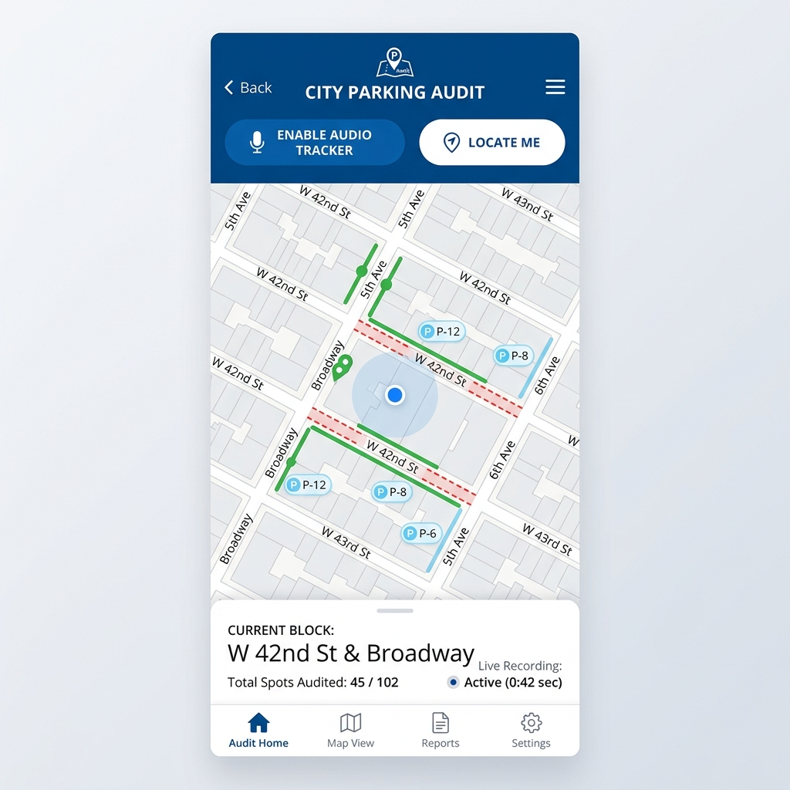
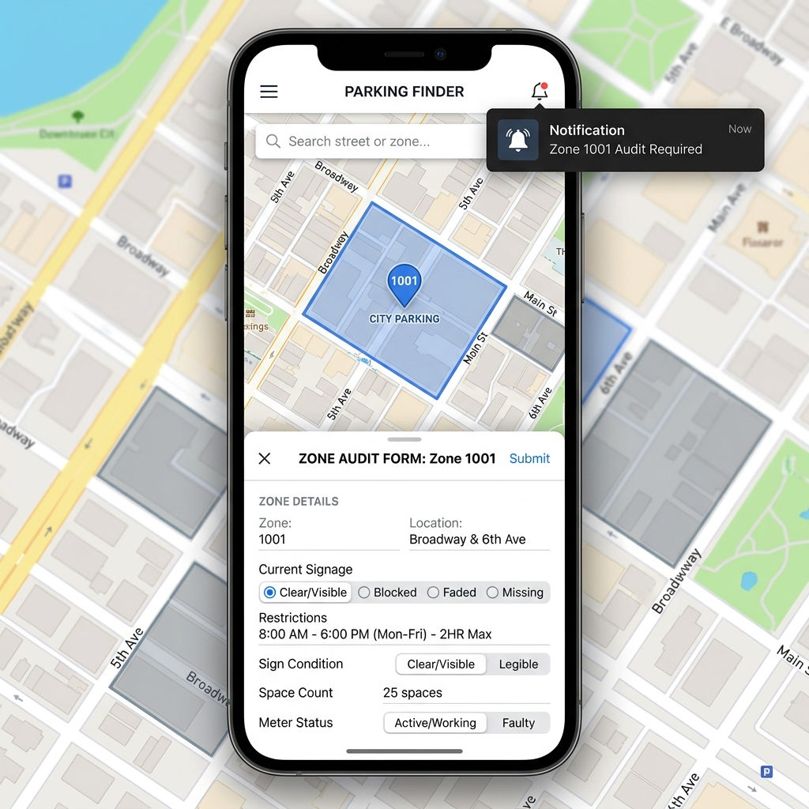
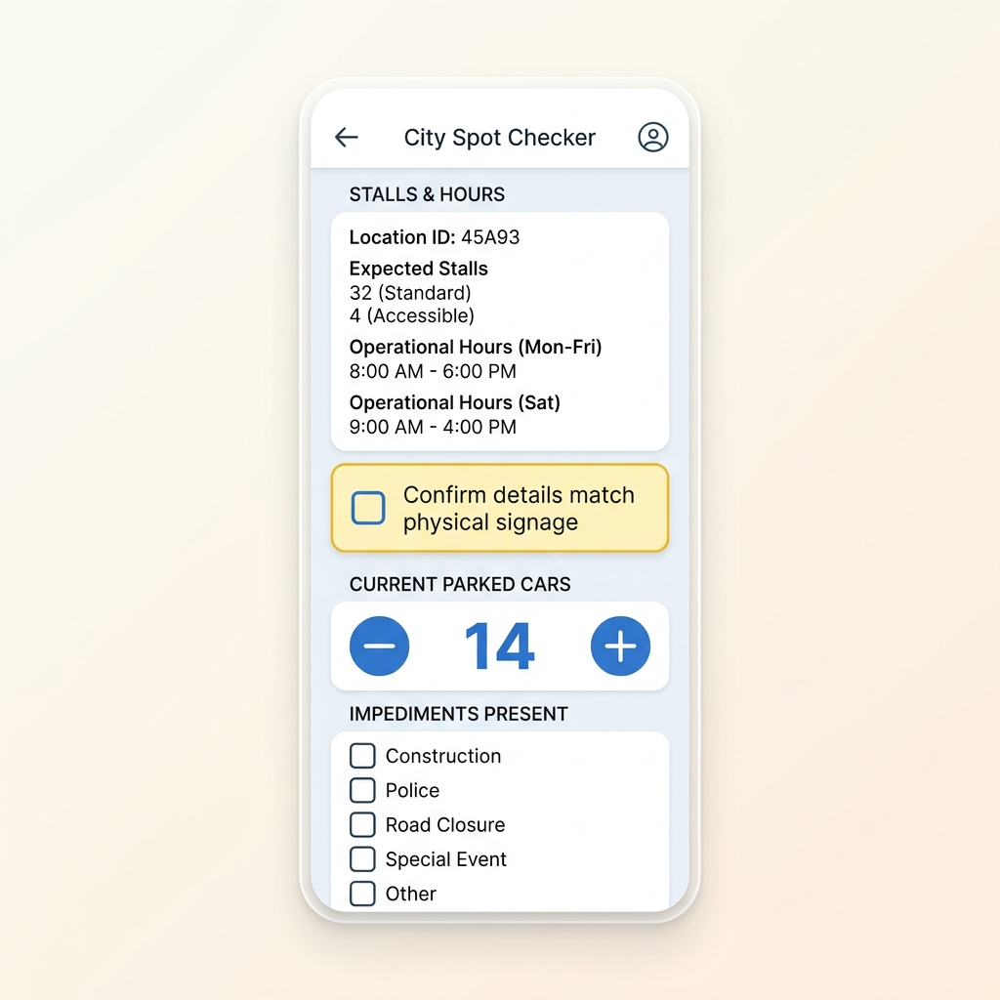
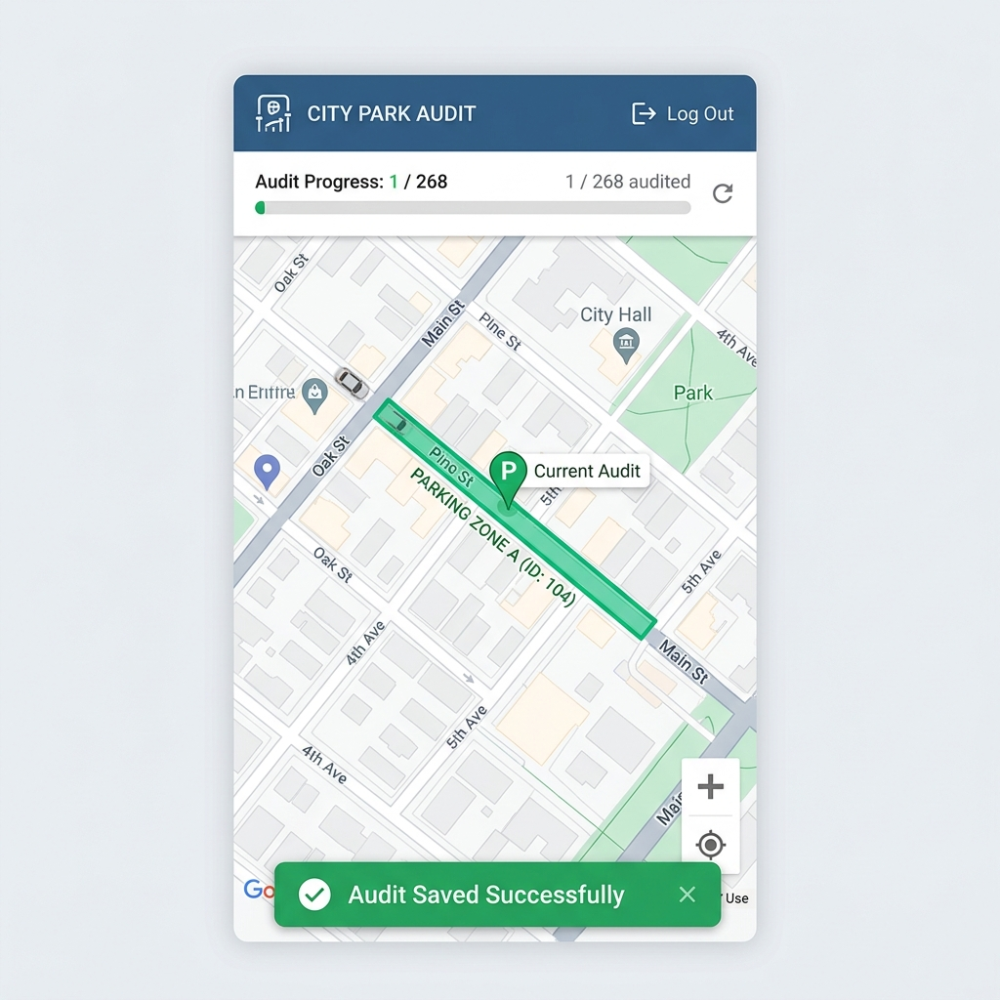

# EPark Auditor Training Guide

This brief training document will guide you step-by-step through performing a parking zone audit using the mobile application.

---

## Step 1: Initial Setup

When you first open the app on your mobile device or tablet, do the following:

1. Tap **Enable Audio Tracker** in the bar below the search box. This allows the app to chime when you enter a zone, or sound an alarm if you forget to save your work.
2. Tap **Locate Me** to let the app use your device's GPS. The map will center on your location, represented by a pulsing blue dot.

---

## Step 2: Entering a Zone

Start walking down the street. 

1. As you enter a colored parking zone on the map, your phone will play a pleasant **bell chime**.
2. The map will automatically highlight the zone in blue.
3. The **Zone Audit Form** will slide open on your screen, pre-filled with the active zone details.

---

## Step 3: Count Cars and Verify Signage

With the form open, complete these checks:

1. **Verify signs**: Look at the operating hours and location details at the top of the form. Verify they match the physical signs on the street. If they match, check the highlighted yellow confirmation box: **"Confirm details match physical signage"**.
2. **Count cars**: Tap the `+` and `-` buttons to log the number of **Parked Cars** and **Cars with Drivers** inside.
3. **Log Blockages**: If the zone is blocked (e.g. by construction or police activity), check the corresponding impediment box.

---

## Step 4: Save and Complete

Save your audit to complete the zone:

1. Tap the primary blue **Save Audit Details** button at the bottom of the form.
2. A green notification banner reading **"Audit Saved Successfully"** will pop up briefly.
3. The audited zone on the map will turn **emerald green** (or red if it was blocked), indicating it is complete.
4. The **Audit Progress** bar at the top of your screen will update. You are now ready to walk to the next zone!

